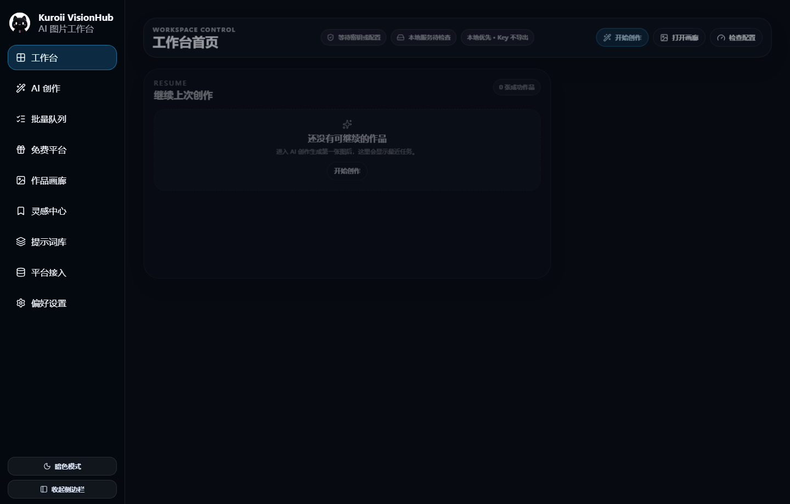

<p align="center">
  
</p>

<h1 align="center">Kuroii VisionHub</h1>

<p align="center">
  <a href="README.md">简体中文</a>
  ·
  <strong>English</strong>
</p>

<p align="center">
  A local-first AI image workspace for Windows that brings relay APIs, official APIs, local models, prompts, references, and galleries into one desktop app.
</p>

<p align="center">
  <a href="https://github.com/kuroii07/Kuroii-VisionHub/releases">Download pre-release</a>
  ·
  <a href="docs/visionhub-development-plan.md">Development plan</a>
  ·
  <a href="docs/provider-contract.md">Provider contract</a>
</p>

<p align="center">
  
  
  
  
</p>

## Interface Preview

The workspace home brings recent work, configuration status, pending tasks, and common actions together.



## Overview

Kuroii VisionHub is a desktop-first AI image workflow tool. It combines text-to-image, image-to-image, provider configuration, batch jobs, prompt utilities, a local gallery, and inspiration collections in one workspace.

The project is designed primarily for relay and aggregator API workflows while retaining official API and local-model routes. App data, generation history, and image directories stay local by default. API keys are stored through desktop system credentials and are never committed to the repository.

## Download

Download the current pre-release from [GitHub Releases](https://github.com/kuroii07/Kuroii-VisionHub/releases).

Recommended for most users:

```text
Kuroii-VisionHub_0.5.25_x64-setup.exe
```

This is the current-user installer and has completed basic installation and uninstallation validation.

Other files:

- `Kuroii-VisionHub.exe`: portable executable that can run without installation.
- `Kuroii-VisionHub_0.5.25_x64_en-US.msi`: MSI package for managed deployment; its default all-users path requires administrator privileges.
- `SHA256SUMS.txt`: SHA256 checksums for the published artifacts.

## Installation

1. Download the recommended NSIS installer.
2. Run the installer.
3. If Windows shows an unknown-publisher warning, verify that the file came from this repository before continuing.
4. Launch Kuroii VisionHub from the Start Menu or desktop shortcut.

The current Windows packages are not code-signed and may trigger a SmartScreen warning.

Reinstalling on the same computer intentionally reuses the existing AppData, gallery, history, and settings to preserve upgrade compatibility. A new user on another computer will not receive that data unless it is copied or restored manually.

## Core Features

- Text-to-image and image-to-image creation with up to four ordered and role-labeled reference images.
- Relay and OpenAI-compatible aggregator APIs as the default integration route.
- Provider profiles, model selection, endpoint paths, extra headers, diagnostics, and image-input mapping.
- Official API and local-model routes, including ComfyUI and Stable Diffusion WebUI / Forge workflows.
- Prompt polishing, image-to-prompt analysis, prompt templates, prompt excerpts, and reusable history.
- A local gallery with filters, favorites, ratings, folders, diagnostics, and reference-image reuse.
- An inspiration center for local image collections, prompt-site directories, source metadata, and license notes.
- Batch queues and multi-model comparisons with retry, pause and resume, and side-by-side results.
- Light and dark themes, a collapsible sidebar, Chinese and English UI, and Windows desktop packaging.

## Integration Guide

### Relay and Aggregator APIs

This is the default workflow. Endpoint paths, request fields, and image-to-image reference structures differ between providers, so the protocol and image-input mapping must follow each provider's documentation.

Common protocol shapes include:

- OpenAI Images generations / edits
- OpenAI Responses `input_image`
- Chat Completions `image_url`
- JSON `image` / `images`

### Official APIs

Official APIs use dedicated adapters instead of assuming that every platform is OpenAI-compatible. Platforms without a verified implementation remain read-only plans or templates and do not expose actions that imply they are ready for generation.

### Local Models

Local models require the corresponding local service to be running and a valid workflow or endpoint configuration. The current routes focus on ComfyUI and the implemented Stable Diffusion WebUI / Forge capabilities.

## Data and Privacy

- Provider API keys are stored in system credentials under `profile:${profileId}`.
- Prompt polishing uses the separate `prompt-polish:default` credential and never reuses an image-provider key.
- Generation history, galleries, inspiration collections, settings, and caches are local by default.
- Language switching translates the app interface only. User prompts, model and provider names, file paths, and raw API errors remain unchanged.
- Settings backups do not export API keys or delete existing system credentials.
- Removing an app record does not delete the original image file from disk by default.
- The app does not modify AiMaMi, Clash / VPN, system proxy, or DNS settings.
- API keys, user AppData, generated images, `node_modules`, `dist`, and `src-tauri/target` are not committed to the repository.

## Development

Stack: Tauri v2, React 19, TypeScript, Vite 6, Zustand, and Rust.

```powershell
git clone https://github.com/kuroii07/Kuroii-VisionHub.git
cd Kuroii-VisionHub
npm.cmd install
npm.cmd run tauri:dev
```

Common checks:

```powershell
npm.cmd run build
python .\scripts\smoke_check.py
cargo check
git diff --check
```

Build Windows release artifacts:

```powershell
npm.cmd run tauri:build
```

## Project Structure

```text
src/                    React frontend, providers, services, state, and pages
src-tauri/              Tauri backend, desktop commands, and bundle configuration
scripts/                Validation, build, launch, and release scripts
docs/                   Product, provider, gallery, inspiration, and release docs
planning/               Product plans and reference assets
```

## Documentation

- [Development plan](docs/visionhub-development-plan.md)
- [Provider contract](docs/provider-contract.md)
- [Library V2 plan](docs/library-v2-plan.md)
- [Inspiration Center roadmap](docs/inspiration-center-roadmap.md)
- [v0.5.25 bilingual release notes](docs/release-notes/0.5.25.md)
- [v0.5.25 Windows installer validation](docs/release-notes/0.5.25-installer-validation.md)

## Current Version

Current version: `v0.5.25`

This is the first pre-release published after the move to `kuroii07/Kuroii-VisionHub`. Repository and in-app release links now point to the new location while AppData, provider profile IDs, system credential bindings, and internal compatibility identifiers remain unchanged.

Before `v1.0`, the project will focus on upgrade, uninstallation, signing risk, migration, and second-computer validation instead of another large feature expansion.

## Release Policy

- The GitHub repository contains source code, documentation, tests, and build scripts.
- EXE, MSI, NSIS, and checksum files are distributed through GitHub Releases.
- User data, generated images, credentials, and local build directories are not stored in the source repository.
- Current builds are pre-releases. A stable release will follow after release and migration validation is complete.

## License

This repository does not currently include a standalone open-source license. Until one is added, do not assume that the source may be freely copied, modified, or redistributed.
